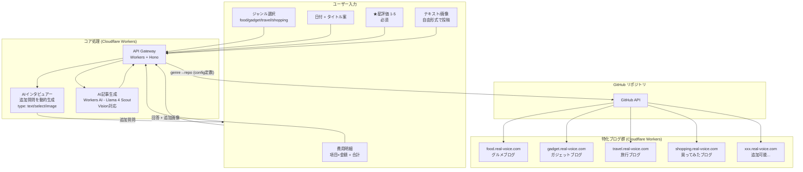
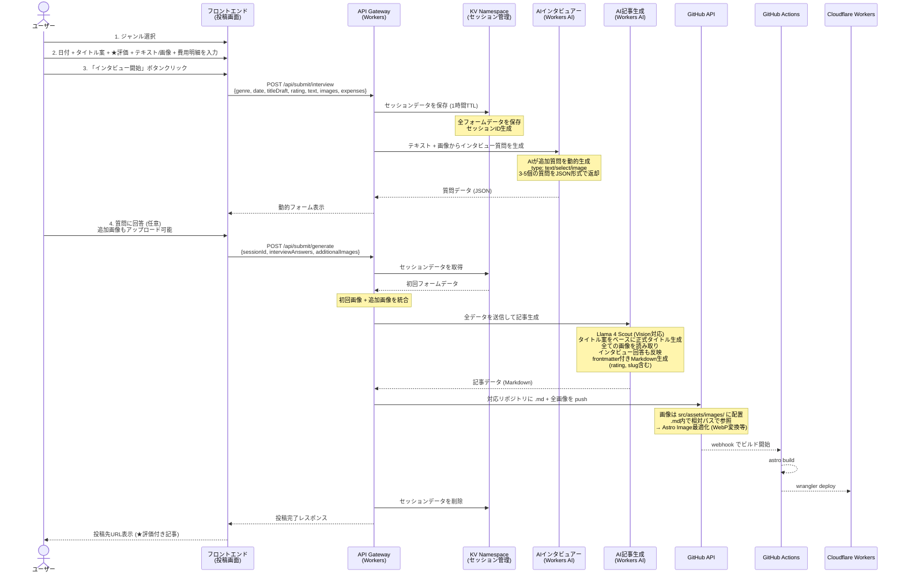
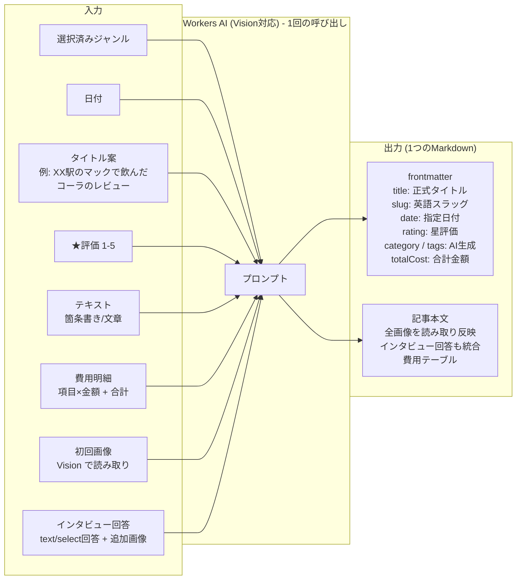
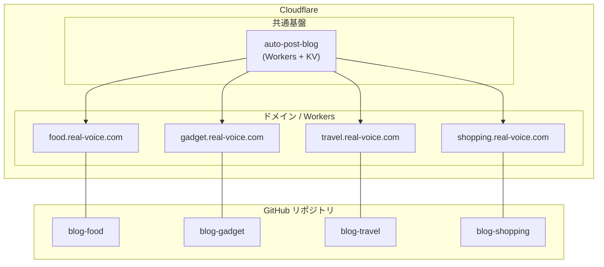
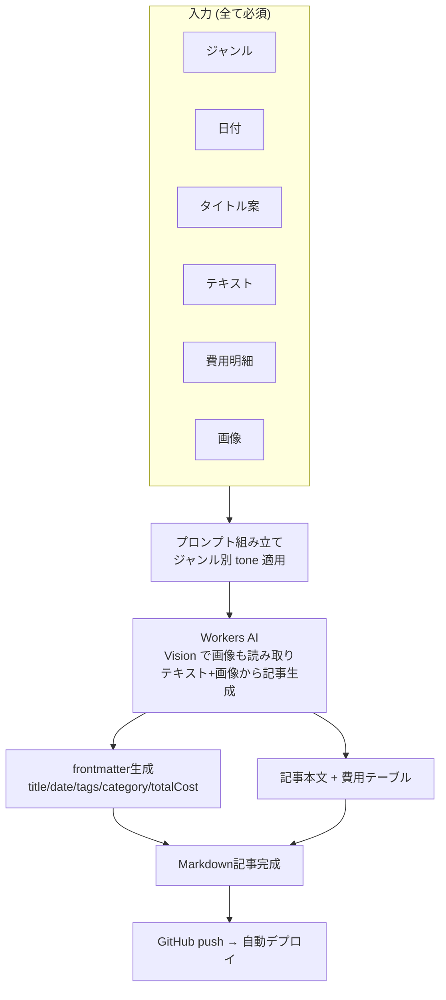

# Auto Post Blog - 設計書

## 概要

ユーザーがジャンルを選択し、画像や感想（箇条書き・文章など自由形式）、星評価を入力すると、AIが**インタビュー形式**で追加質問を動的に生成。ユーザーの回答を基に、より詳細で魅力的な記事を自動生成し、選択されたジャンルに対応するCloudflareドメインの特化ブログに自動投稿するシステム。

**v0.1.0の新機能:**
- 動的インタビューフォーム（AIが質問タイプを指定: text/select/image）
- 星評価機能（1-5星、ブログに表示）

---

## システム全体像




---

## 投稿フロー詳細




---

## AI記事生成エンジン詳細

ジャンルはユーザーが選択済み。AIの役割は**テキスト+画像から記事を生成**すること。

Vision対応モデルを使い、画像の内容も読み取って記事に反映する。




AIに渡すプロンプト1回で、タイトル・カテゴリ・タグ・本文をまとめて生成する。
画像がある場合はVisionで内容を読み取り、ユーザーのテキストを補足する情報として記事に反映する。

例: ユーザー「イチゴが美味しかった」+ 画像 → AIが画像から「大粒で真っ赤な」等の情報を読み取り記事に盛り込む。

### AIへの入力と出力の例

**入力:**
```json
{
  "genre": "food",
  "date": "2026-02-13",
  "titleDraft": "博多駅近くの豚骨ラーメン屋のレビュー",
  "rating": 5,
  "text": "・豚骨スープ最高\n・替え玉2回した",
  "expenses": {
    "items": [
      { "name": "ラーメン", "amount": 750 },
      { "name": "替え玉×2", "amount": 300 },
      { "name": "ビール", "amount": 500 }
    ],
    "total": 1550
  },
  "images": ["ramen-001.jpg"],
  "interviewAnswers": [
    {
      "question": "その料理の味を詳しく教えてください",
      "answer": "濃厚だけどしつこくない。臭みも全くない完璧なバランス"
    },
    {
      "question": "お店の雰囲気やサービスはどうでしたか？",
      "answer": "カウンターのみ8席。店主の接客が丁寧で良かった"
    }
  ],
  "additionalImages": ["shop-exterior.jpg"]
}
```

**出力:** frontmatter付きMarkdownがそのまま返る
```markdown
---
title: "博多駅すぐの路地裏で出会った絶品豚骨ラーメン"
slug: "hakata-tonkotsu-ramen-hidden-gem"
date: 2026-02-13
category: "ラーメン"
tags: ["豚骨", "博多", "替え玉"]
rating: 5
totalCost: 1550
---


濃厚な豚骨スープが...（記事本文）

## お店の雰囲気


カウンターのみ8席の小さなお店。店主の接客が丁寧で...

## かかった費用

| 項目 | 金額 |
|------|------|
| ラーメン | ¥750 |
| 替え玉×2 | ¥300 |
| ビール | ¥500 |
| **合計** | **¥1,550** |
```

- `title`: タイトル案をベースにAIがSEO・読みやすさを考慮して正式タイトルに仕上げる
- `slug`: titleを英語翻訳し小文字ハイフン区切りで記述（例: "hakata-tonkotsu-ramen-hidden-gem"）
- `date`: ユーザー指定の値をそのまま使う
- `rating`: ユーザー指定の星評価をそのまま使う（1-5の整数）
- `category` / `tags`: AIがテキスト+画像+インタビュー回答から判断して生成
- 画像: 初回画像+追加画像をすべて記事内の適切な位置に配置
- インタビュー回答: 自然な形で記事本文に統合
- 費用明細: ユーザー入力をそのままテーブルとして記事末尾に配置。frontmatterにも `totalCost` を入れておく（一覧ページでの表示用）

## ドメイン構成




## 技術スタック

| レイヤー | 技術 | 用途 |
|---------|------|------|
| **フロントエンド(投稿画面)** | Hono + JSX / htmx | シンプルな投稿フォーム |
| **API** | Cloudflare Workers (Hono) | リクエスト処理・ルーティング |
| **AI記事生成** | Cloudflare Workers AI | カテゴリ/タグ抽出・記事生成 (無料枠あり) |
| **記事+画像管理** | GitHub + .md + images | Git = バックアップ & 履歴 & デプロイトリガー |
| **ブログSSG** | Astro | 各特化ブログの静的生成 |
| **ホスティング** | Cloudflare Workers (Static Assets) | 各ブログのデプロイ |
| **CI/CD** | GitHub Actions | Astro ビルド + `wrangler deploy` |

---

## コスト設計 (無料運用)

### Cloudflare 無料枠一覧

| サービス | 無料枠 | 備考 |
|---------|--------|------|
| **Workers** | 100,000 リクエスト/日 | 十分すぎる |
| **Workers AI** | 10,000 Neurons/日 | 毎日 00:00 UTC リセット |
| **Workers Static Assets** | 無制限 | Workers の無料枠に含まれる |
| **GitHub API** | 5,000 リクエスト/時 | 十分 |

### Workers AI モデル

| モデル | 特徴 |
|--------|------|
| **`@cf/meta/llama-4-scout-17b-16e-instruct`** | Vision対応 (テキスト+画像入力)。MoE構造で効率的。多言語対応。これ1つで完結。 |

1日1〜3投稿の想定。10,000 Neurons/日の無料枠に対して余裕があるため、フォールバックモデルは不要。常に最高品質のモデルを使う。

---

## ディレクトリ構成（案）

### auto-post-blog（このリポジトリ）

API + 投稿画面のモノレポ。ブログ本体はここに含めない。

```
auto-post-blog/
├── apps/
│   └── worker/                 # Cloudflare Workers (Hono)
│       ├── src/
│       │   ├── index.ts        # エントリポイント
│       │   ├── routes/
│       │   │   ├── pages.tsx   # フロントエンド (Hono JSX)
│       │   │   └── submit.tsx  # 投稿API (インタビュー+記事生成)
│       │   ├── services/
│       │   │   ├── interviewer.ts  # AIインタビュアー
│       │   │   ├── generator.ts    # AI記事生成エンジン
│       │   │   └── publisher.ts    # GitHub push処理
│       │   ├── views/
│       │   │   ├── layout.tsx  # HTMLレイアウト
│       │   │   ├── form.tsx    # 投稿フォーム
│       │   │   └── result.tsx  # 結果表示
│       │   └── types.ts
│       ├── public/
│       │   ├── styles.css      # スタイル (星評価UI含む)
│       │   └── app.js          # クライアントJS
│       └── wrangler.jsonc      # Workers設定 (KV/AI/Assets)
│
├── packages/
│   └── shared/                 # 共有型定義・ユーティリティ
│       ├── src/
│       │   ├── config.ts       # ジャンル→ドメインマッピング (food/gadget/travel/shopping)
│       │   ├── types.ts        # 共通型定義
│       │   └── index.ts
│       └── package.json
│
├── package.json
└── DESIGN.md                   # この設計書
```

### blog-template（別リポジトリ / GitHub Template Repository）

各ブログの雛形。GitHub の「Use this template」で新ブログリポジトリを生成する。

```
blog-template/
├── src/
│   ├── layouts/
│   │   ├── BaseLayout.astro     # ベースレイアウト
│   │   └── PostLayout.astro     # 記事レイアウト (★評価表示含む)
│   ├── pages/
│   │   ├── index.astro          # トップページ (★評価表示含む)
│   │   └── posts/[...slug].astro
│   ├── content/
│   │   └── posts/               # .md 記事ファイル (API が push する先)
│   └── assets/
│       └── images/              # 投稿画像 (Astro Image最適化対象)
├── .github/
│   └── workflows/
│       └── deploy.yml           # astro build → wrangler deploy
├── astro.config.mjs
├── wrangler.jsonc               # Workers Static Assets 設定
├── package.json
└── README.md
```

### リポジトリ関係図

GitHub Organization（例: `real-voice-com`）で全リポジトリを管理する。

```
GitHub Organization: real-voice-com
  ├── auto-post-blog   … API + 投稿画面（このリポジトリ）
  ├── blog-template    … Astro テンプレート (GitHub Template Repository)
  ├── blog-food        … blog-template から生成 → food.real-voice.com
  ├── blog-gadget      … blog-template から生成 → gadget.real-voice.com
  ├── blog-travel      … blog-template から生成 → travel.real-voice.com
  └── blog-shopping    … blog-template から生成 → shopping.real-voice.com
```

---

## ジャンル→ドメイン マッピング (コード内定数)

```typescript
// packages/shared/src/config.ts
export const GENRES = {
  food: {
    label: "グルメ・飲食",
    domain: "food.real-voice.com",
    repo: "real-voice-com/blog-food",
    tone: "casual" as const,
  },
  gadget: {
    label: "ガジェット",
    domain: "gadget.real-voice.com",
    repo: "real-voice-com/blog-gadget",
    tone: "technical" as const,
  },
  travel: {
    label: "旅行・観光",
    domain: "travel.real-voice.com",
    repo: "real-voice-com/blog-travel",
    tone: "casual" as const,
  },
  shopping: {
    label: "買ってみた",
    domain: "shopping.real-voice.com",
    repo: "real-voice-com/blog-shopping",
    tone: "casual" as const,
  },
} as const;

export type Genre = keyof typeof GENRES;
export type GenreConfig = (typeof GENRES)[Genre];
export type Tone = GenreConfig["tone"];
```

---

## 記事生成フロー




### 生成されるMarkdownの例

ユーザー入力:
- ジャンル: `food`
- 日付: `2026-02-13`
- タイトル案: `博多駅近くの豚骨ラーメン屋のレビュー`
- 内容: `・豚骨スープ最高 ・替え玉2回した`
- 費用: ラーメン ¥750 / 替え玉×2 ¥300 / ビール ¥500 → 合計 ¥1,550
- 画像: ラーメンの写真1枚

↓ AIが生成

```markdown
---
title: "博多駅すぐの路地裏で出会った絶品豚骨ラーメン"
date: 2026-02-13
category: "ラーメン"
tags: ["豚骨", "博多", "替え玉"]
image: "../../assets/images/2026/02/ramen-001.jpg"
totalCost: 1550
---


博多駅から歩いて5分、路地裏にひっそり佇むこのお店。
白濁した濃厚豚骨スープに極細麺が絡み、一口すすれば...

## ポイント

- スープ：濃厚だけどしつこくない
- 麺：バリカタがおすすめ
- 替え玉：必須。2玉いける

## かかった費用

| 項目 | 金額 |
|------|------|
| ラーメン | ¥750 |
| 替え玉×2 | ¥300 |
| ビール | ¥500 |
| **合計** | **¥1,550** |

次回は味玉トッピングも試したい。
```

---

## 投稿フォーム UI イメージ

```
┌──────────────────────────────────────┐
│  Auto Post Blog v0.1.0               │
├──────────────────────────────────────┤
│                                      │
│  🏷️ ジャンル (必須)                   │
│  ┌────────┐┌────────┐┌────────┐      │
│  │⚫ グルメ││ ガジェット││ 旅行   │      │
│  └────────┘└────────┘└────────┘      │
│  ┌────────┐                          │
│  │ 買ってみた│                         │
│  └────────┘                          │
│                                      │
│  📅 日付                              │
│  [ 2026-02-13         ]              │
│                                      │
│  💡 タイトル案                        │
│  [ XX駅のマックで飲んだコーラのレビュー ]│
│                                      │
│  📝 内容                              │
│  ┌──────────────────────────────────┐│
│  │ (自由入力エリア)                   ││
│  │                                  ││
│  │ 例:                              ││
│  │ ・Lサイズ100円キャンペーン中       ││
│  │ ・氷多め最高                      ││
│  │ ・ポテトもセットで頼んだ          ││
│  │                                  ││
│  └──────────────────────────────────┘│
│                                      │
│  ⭐ 総合評価 (必須)                   │
│  ☆ ☆ ☆ ☆ ☆  ← クリックで選択       │
│                                      │
│  💰 費用 (必須)                       │
│  ┌──────────────┬──────────┐         │
│  │ 項目         │ 金額     │         │
│  ├──────────────┼──────────┤         │
│  │ コーラL      │ 100      │         │
│  │ ポテトM      │ 330      │         │
│  │ [+ 項目を追加]          │         │
│  ├──────────────┼──────────┤         │
│  │ 合計         │ 430      │         │
│  └──────────────┴──────────┘         │
│                                      │
│  📷 画像を追加                        │
│  [ファイル選択]                       │
│                                      │
│  [ 💬 インタビュー開始 ]              │
│                                      │
├──────────────────────────────────────┤
│  📝 AI追加質問 (動的生成)             │
│                                      │
│  質問1: その料理の味を詳しく教えて    │
│  ┌──────────────────────────────────┐│
│  │ 甘い・辛い・濃厚など...            ││
│  └──────────────────────────────────┘│
│                                      │
│  質問2: 誰と行きましたか？            │
│  [一人で ▼] ← ドロップダウン         │
│                                      │
│  質問3: お店の外観写真があれば        │
│  [ファイル選択] ← 追加画像           │
│                                      │
│  [ ✨ 回答して記事を生成 ]            │
│                                      │
└──────────────────────────────────────┘
```

---

## 新ジャンル追加手順

1. `blog-template` リポジトリで「Use this template」→ 新リポジトリ作成（例: `blog-gaming`）
2. `wrangler.jsonc` の `name` とカスタムドメインを設定（例: `gaming.real-voice.com`）
3. `packages/shared/src/config.ts` の `GENRES` に新ジャンルを追加
4. Cloudflare ダッシュボードで Workers にカスタムドメインを紐付け

---

## 今後の拡張案

- **LINE Bot連携**: LINEからテキスト/画像を送るだけで投稿
- **音声入力**: Whisper APIで音声→テキスト変換→投稿
- **スケジュール投稿**: 投稿日時の予約
- **アナリティクス**: 各ブログのPV/流入元を一元管理
- **SEO最適化**: AI がメタディスクリプション・構造化データを自動生成
- **ブログ横断検索**: 全ドメインの記事を横断検索

---

## 開発フェーズ

| Phase | 内容 | 状態 |
|-------|------|------|
| **Phase 1** | API基盤 + ジャンル選択UI + AI記事生成 + 1ドメイン投稿 | ✅ 完了 |
| **Phase 2** | 画像対応 + 複数ドメイン対応 + 費用明細 | ✅ 完了 |
| **v0.1.0** | **動的インタビューフォーム + 星評価機能** | ✅ **完了** |
| **Phase 3** | LINE Bot / 音声入力 | 未着手 |

---

## v0.1.0 リリース内容 (2026-02-14)

### 新機能

1. **動的インタビューフォーム**
   - AIが初回フォームの内容を分析し、追加質問を動的生成
   - 質問タイプ: `text` (テキスト入力), `select` (選択肢), `image` (画像追加)
   - 3-5個の質問を生成、すべて任意回答
   - 追加画像も記事生成に統合

2. **星評価機能**
   - 1-5星の評価を必須入力
   - クリック可能な星アイコンUI (★☆)
   - ブログの記事ページと一覧ページに表示
   - frontmatterに`rating`フィールド追加

3. **技術的改善**
   - KV Namespaceでセッション管理 (1時間TTL)
   - 初回フォーム → インタビュー → 記事生成の2ステップフロー
   - slugフィールド自動生成（英語翻訳ハイフン区切り）

### 対応ジャンル

- グルメ・飲食 (food)
- ガジェット (gadget)
- 旅行・観光 (travel)
- 買ってみた (shopping)

### デプロイURL

https://auto-post-blog.hinaharu-0014.workers.dev
